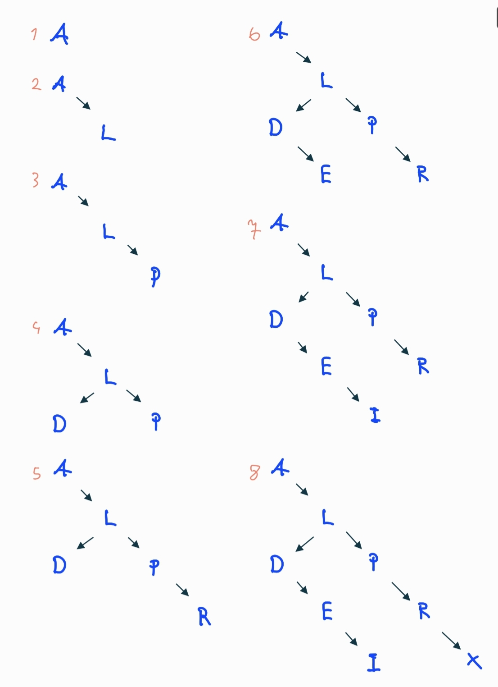
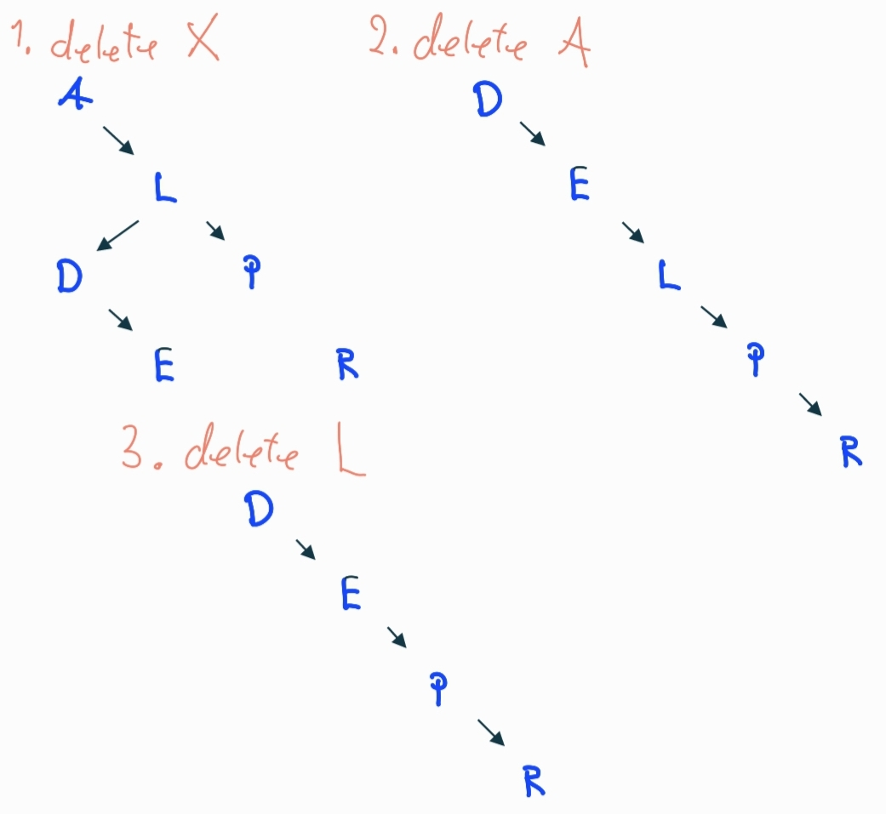
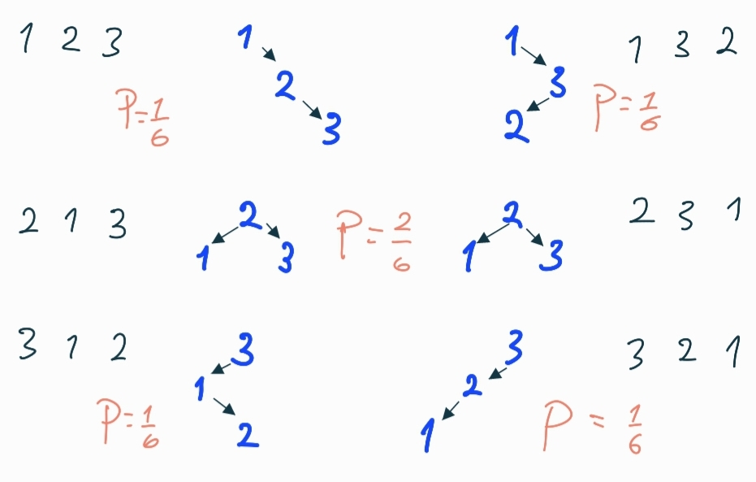

# Lab 04: Trees
Contributors: 
- Kacper Lukasz Nowicki [kacperln@ntnu.no](mailto:kacperln@ntnu.no)
- Jakob Holkestad Molnes [jakobmo@ntnu.no](mailto:jakobmo@ntnu.no)
## Q1
### a)

### b)

### c)
if $n=3$, $n!=6$ insertion combinations, $5$ different trees
  
Probability for each tree is $1\over6$, though the same tree appears twice, thus probability for that particular one is ${2\over6}={1\over3}$  
If all possible trees had the same probability, it would be $1\over5$

## Q2
*in order to call ay of bellow methods, pass the **root node** of the tree as parameter*
### a)
```java
public void inOrderTraversal(Node node) {
    if (node == null) {
        return;
    }
    inOrderTraversal(node.left);
    System.out.println(node.item);
    inOrderTraversal(node.right);
}
```
### b)
```java
public void postOrderTraversal(Node node) {
    if (node == null) {
        return;
    }
    postOrderTraversal(node.right);
    System.out.println(node.item);
    postOrderTraversal(node.left);
}
```
### c)
```java
public void preOrderTraversal( Node node) {
    if (node == null) {
        return;
    }
    System.out.println(node.item);
    preOrderTraversal(node.left);
    preOrderTraversal(node.right);
}
```

### Q3
## a)
```java
package no.ntnu.idata2302.lab04;

import java.util.ArrayList;

public class Heap<Item extends Comparable<Item>> {
  private final ArrayList<Item> items;

  public Heap() {
    this.items = new ArrayList<>();
  }

  public Item extractMin() {
    Item min = items.get(0);
    swap(0, items.size() - 1);
    items.remove(items.size() - 1);
    bubbleDown(0);
    return min;

  }

  private int parentIndex(int index) {
    return (index - 1) / 2;
  }

  private int leftChildIndex(int index) {
    return index * 2 + 1;
  }

  private int rightChildIndex(int index) {
    return index * 2 + 2;
  }

  public Heap<Item> insert(Item item) {
    items.add(item);
    bubbleUp(lastIndex());
    return this;
  }

  private int lastIndex() {
    return items.size() - 1;
  }

  private void bubbleUp(int nodeIndex) {
    while (!isRoot(nodeIndex)) {
      int parentIndex = parentIndex(nodeIndex);
      int difference = itemAt(parentIndex)
        .compareTo(itemAt(nodeIndex));
      if (difference > 0) {
        swap(parentIndex, nodeIndex);
      }
      nodeIndex = parentIndex;
    }
  }

  private void swap(int parentIndex, int nodeIndex) {
    Item temp = items.get(parentIndex);
    items.set(parentIndex, items.get(nodeIndex));
    items.set(nodeIndex, temp);
  }

  private Item itemAt(int index) {
    return items.get(index);
  }

  private boolean isRoot(int nodeIndex) {
    return nodeIndex == 0;
  }

  public Item next() {
    swap(lastIndex(), 0);
    Item item = items.remove(lastIndex());
    bubbleDown(0);
    return item;
  }

  private void bubbleDown(int parentIndex) {
    while (hasAnyChildren(parentIndex)) {
      int leastChildIndex = leastChildIndex(parentIndex);
      int difference = itemAt(parentIndex)
        .compareTo(itemAt(leastChildIndex));
      if (difference <= 0) {
        break;
      }
      swap(parentIndex, leastChildIndex);
      parentIndex = leastChildIndex;
    }
  }

  private int leastChildIndex(int parentIndex) {
    if (!hasLeftChild(parentIndex)) {
      return rightChildIndex(parentIndex);
    }
    if (!hasRightChild(parentIndex)) {
      return leftChildIndex(parentIndex);
    }
    int leftDifference = itemAt(leftChildIndex(parentIndex))
      .compareTo(itemAt(rightChildIndex(parentIndex)));
    if (leftDifference <= 0) {
      return leftChildIndex(parentIndex);
    }
    return rightChildIndex(parentIndex);
  }

  private boolean hasRightChild(int parentIndex) {
    return rightChildIndex(parentIndex) < items.size();
  }

  private boolean hasLeftChild(int parentIndex) {
    return leftChildIndex(parentIndex) <= lastIndex();
  }

  private boolean hasAnyChildren(int index) {
    return leftChildIndex(index) <= lastIndex();
  }

  public String toString() {
    return items.toString();
  }
}
```
## b)
